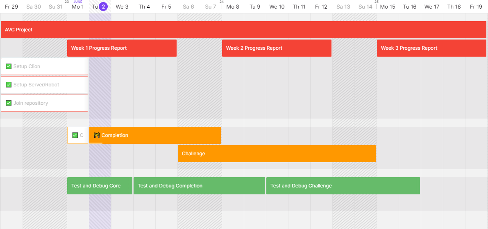

# AVC Project
 Team 17 AVC Project
 
# Timeline 

# Project Plan
 
AVC Plan
## Team Name: Team 17
## Team Members & contact info:
Isaac - youngish@myvuw.ac.nz
Elliot - challeelli@myvuw.ac.nz
Paris - petikapari@myvuw.ac.nz
Sridhar - venkatsrid@myvuw.ac.nz
## Communication tool:
Facebook
Roles:

### Isaac - Project Manager (organising team meetings, reporting regularly on progress)

### Elliot - Software Architect (writing core code and extending functionality)

### Paris, Sridhar - Software writing, testing and documentation (debugging software and committing to git, writing test cases and documenting performance against milestones)

## Github: https://github.com/isaacy2012/AVC-Project

1st Deadline:
Due Date - 25/05/20 - 1/06/20
Objective: Have resources necessary to start project

Tasks:
[All] Complete AVC plan

[All] - Make sure to have compiler setup with the additional library and makefile

[All]- Ensure server is running along with client along with helper files

[All]- Get/save pictures from the camera view.

[All] - Join the team repository made by Isaac

2nd Deadline:
Due Date - 1/06/20 - 10/06/20
Objective - Have Core and Completion done

[All] - Test and debug core

[All] - Test and debug completion

3rd Deadline - 10/06/20 - 17/06/20

[All] - Test and Debug Challenge

# Install

See below for installation instructions for a system running Linux.

###Prerequisites
The code relys on the SFML library to function.

Firstly, download the linux version of [SFML from here](https://www.sfml-dev.org/download/sfml/2.5.1/). Please note this is for a 64 bit system, for a 32 bit system you must compile from source (instructions available on the sfml website).

Then simply extract the file using the method of your choice. For convinience, we recommended you extract it to your home folder and rename the folder SFML. If done correctly, you should have something similar to the following directory structure.

###Continuing installation
The next step is to download the contents of the repo. Use the download zip button, [on this page](https://github.com/isaacy2012/AVC-Project).

Extract this to a destination of your choice.

###Editing makefiles
The next step is to edit the provided makefiles to make the compile based on your specific system. The first makefile to edit is located in the AVC_robot folder. Simply open this file with a text editor of your choice, and follow the below steps.

The first line should point to your SFML installation. Assuming you installed it to your home directory as instructed, then simply change the red unlined text to whatever your username is on your system. Save the file.

The second makefile to edit is located in the AVC_server folder. Simply open this file with a text editor of your choice, and follow the below steps. Make the same change to the first line as described before. Save the file.

###Compiling the code
The next step is to compile the code. Open a terminal in the AVC_robot folder, and type the command "make" (without quotes). This should compile and build without problems if you followed the previous steps correctly. Then open a terminal in the AVC_server folder, and type the command "make" (without quotes) again.

###Running the code
Simply open a terminal in the AVC_server folder and type "./server3" (without quotes) to run the server. Then open a terminal in the AVC_robot folder and type "./robot" (without quotes) to run the robot code.
